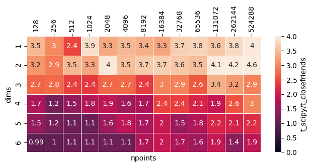

# closefriends

A Python package for finding pairs of points within a fixed distance utilising the [Cell Lists](https://en.wikipedia.org/wiki/Cell_lists)
strategy and sorting to improve sequential iteration over the pair list (like described [here](https://developer.download.nvidia.com/assets/cuda/files/particles.pdf)).

## Motivation

In the Python world, there is already the well-established KDTree sub-module for finding pairs of points within an
arbitrary-dimensioned particle cloud. It can be a little slow in some cases. For the purposes of Weakly-Compressible
Smoothed Particle Hydrodymics simulations (WCSPH), this package is faster for finding pairs by:

* using cell lists, which can be faster for 1/2/3D problems;
* using user-defined pre-sized arrays to store resultant pairs, which can speed up code by 2-3x.

The use of pre-sized arrays is significantly faster, but comes at the cost of less user-friendliness. This is because
you must provide an upper limit on number of pairs, and if the actual number of pairs found is higher, the function
fails (with an error message). For WCSPH simulations, the upper limit is known apriori, and doesn't change throughout
the simulation.

## Usage

The `closefrieds.query_pairs` function accepts a 2D Numpy `ndarray` where rows represent each point, and colums
represent points' coordinates.


```python
import numpy as np, closefriends

dim = 2      # 3 spatial dimensions
npoints = 100 # 10 points
r = 0.2      # cutoff distance
maxnpair = 1000 # estimated pairs per points
maxnpair = int(maxnpair)

# generating random points with coordinates between 0 and 1
rng = np.random.default_rng(12345)
x = rng.random(dim*npoints).reshape((npoints, dim))

# finding pairs using closefriends.query_pairs
pairs = closefriends.query_pairs(x, r, maxnpair, output_type="set", retain_order=True)

print(f"printing 10/{len(pairs)} pairs (set of tuples):")
for i, pair in enumerate(pairs):
    print(pair)
    if i > 9: break
```

    printing 10/561 pairs (set of tuples):
    (1, 86)
    (47, 53)
    (16, 93)
    (67, 77)
    (36, 71)
    (8, 9)
    (9, 63)
    (5, 74)
    (21, 37)
    (0, 23)
    (11, 23)


A couple key differences between the usage of `scipy.KDTree.query_pairs` and `closefriends.query_pairs`:
* a third output type `output_type="seperate-ndarrays"` is available. This produces two 1D arrays that describe the pairs.
    * This results in faster performance when combined with `numpy.ufunc.at`.
* default output type is `"seperate-ndarrays"`. This is because: 
    * the intended use case of this package prefers seperate 1D arrays instead of a single ndarray;
    * when using `output_type="set"`, the time taken for both `closefriends` and `scipy.KDTree` is overwhelmingly dominated by the insertion of values into the set.
* a maxnpair value is needed. This tells `closefriends.query_pairs` how large the pairs array needs to be (for performance reasons). If the number of pairs found is larger than the provided `maxnpair`, then a `BufferError` is thrown with an error message

### Sorting strategy

Closefriends sorts the position using a grid by mapping each gridcell into a single integer. The positions are then sorted by these hashes. The benefit is that it improves data locality, i.e., points that are located nearby, are also located nearby in memory. This makes it faster to iterate over the list of pairs. 

The hashing algorithm here is simple, and doesn't aim to improve data locality the most. This is because the simple hashing algorithm used here enables more elegant design of the pair search algorithm. 

Re-ordering of the points is enabled by default, and can be turned off by passing `retain_ordering = True` to the `query_pairs` function call. Note that `retain_ordering = True` also ensures that for each pair, `i < j` - for comatibility with `scipy.KDTree.query_pairs`.

To see how the data is reordered, consider the configuration below:


```python
import matplotlib.pyplot as plt

ax = plt.scatter(x[:, 0], x[:, 1], c=np.arange(npoints))
cb = plt.colorbar(ax, label="Index in point array")
txt = plt.title("Indices of points BEFORE closefriends.query_pairs")
txt = plt.xlabel("x-coordinate")
txt = plt.ylabel("y-coordinate")
```


    

    


When running `closefriends.query_pairs` on this array of points, the particles are reordered, so the points located lower in x and then y directions are located "earlier" in the array.


```python
pair_i, pair_j, idx = closefriends.query_pairs(x, r, maxnpair)

ax = plt.scatter(x[:, 0], x[:, 1], c=np.arange(npoints))
cb = plt.colorbar(ax, label="Index in point array")
txt = plt.title("Indices of points AFTER closefriends.query_pairs")
txt = plt.xlabel("x-coordinate")
txt = plt.ylabel("y-coordinate")
```


    

    


For your convenience, the `idx` array is returned, which tells you the old index of each point in the modified array. For example, if `idx[0]` is equal to `10`, this means that the point located at the position 0, used to be located at position 10. This should allow you to reorder other data as needed.

### NDArray output

Like `scipy.KDTree.query_pairs`, the output can be returned either as a set of tuples, or a 2D ndarray. Return a `set` by passing `output_type = "set"`. Or explicitly ask for an NDArray to be returned with `output_type = "ndarray"`.

## Performance

First consider uniform random points generated using `np.rng.random()`. The number of pairs per point is kept approximately constant with by defining the cutoff as `npoints**(-1./dim)`. The speedups of `closefriends.query_pairs` over `scipy.KDTree.query_pairs` (constructing the tree + querying pairs):



For  3 dims and lower, `closefriends.query_pairs()` maintains at least 2x speedup over `scipy.KDTree.query_pairs`. The relative speed is less as the number of dimensions increase, but `closefriends` apparently retains better performance for larger problem sizes. But key for the purpose of this tool, is that for 2D and 3D problems, closefriends is significantly faster.

if `retain_order = True` and/or `output_type = "ndarray"` are used, the performance should reduce a bit, but should overall still be fast.


